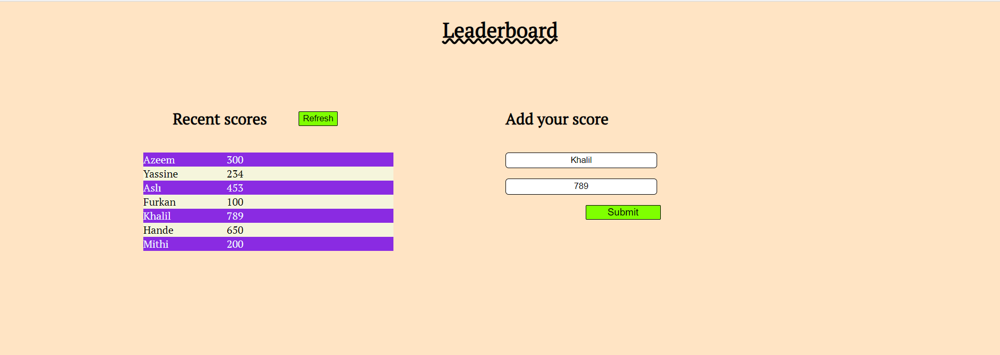

> This is a project to learn asynchronous in JavaScript



You can see asynchronous functions and a calling to an API.

## Live Demo

[Live Demo Link](https://nevisende.github.io/leaderboard/)

## Getting Started
```
$ git clone https://github.com/nevisende/leaderboard.git
// gets the project

$ npm install
// installs all requirements

$ npm run build
// builds files with webpack

$ npm start
// this works as a server to deploy project on your local.
```

👤 **Author**

- GitHub: [@nevisende](https://github.com/nevisende)
- Twitter: [@furkandnzhan](https://twitter.com/furkandnzhan)
- LinkedIn: [Furkan Denizhan](https://linkedin.com/in/furkan-denizhan)

## 🤝 Contributing

Contributions, issues, and feature requests are welcome!

Feel free to check the [issues page](../../issues/).

## Show your support

Give a ⭐️ if you like this project!

## Acknowledgments

- Hat tip to anyone whose code was used
- Inspiration
- etc

## 📝 License

This project is [MIT](./MIT.md) licensed.
